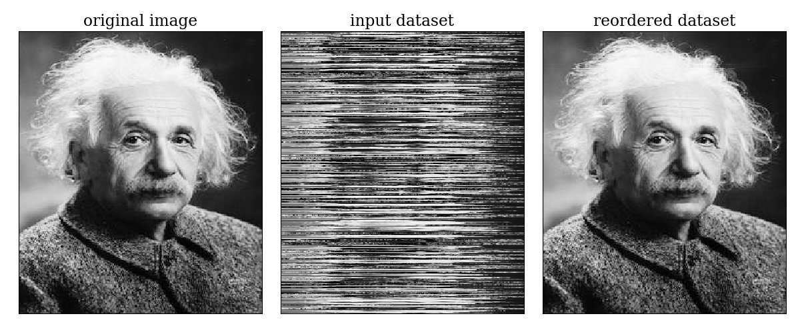
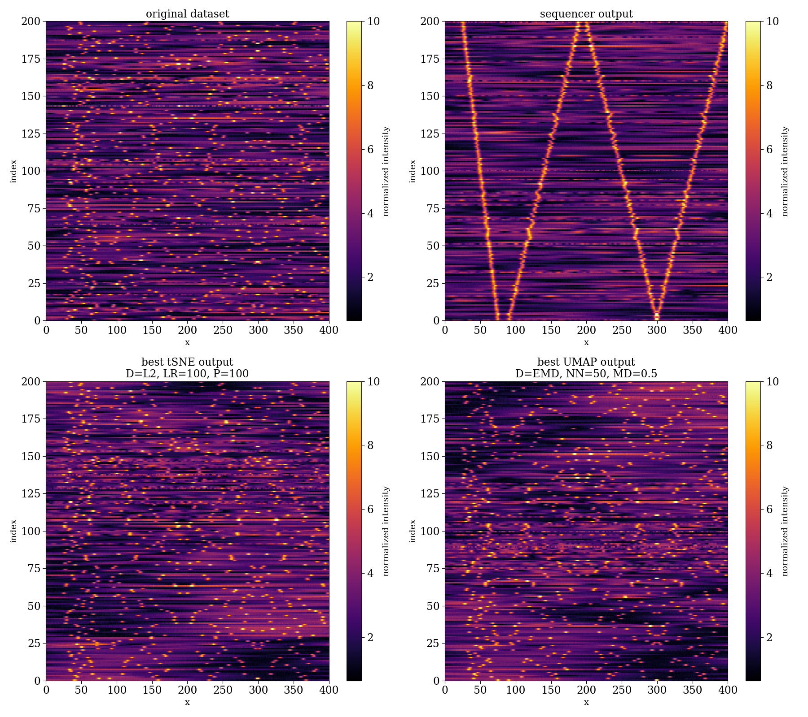

# The Sequencer
An algorithm that detects one-dimensional trends (=sequences) in complex datasets. 

## Overview
The Sequencer is an algorithm that attempts to reveal the main sequence in a dataset, if it exists.  To do so, it reorders objects within a set to produce the most elongated manifold describing their similarities which are measured in a multi-scale manner and using a collection of metrics. To be generic, it combines information from four different distance metrics: the Euclidean Distance, the Kullback-Leibler Divergence, the Monge-Wasserstein or Earth Mover Distance, and the Energy Distance. In addition, it considers different scales by dividing the input data into chunks, and estimating the similarities between objects in each of these chunks. 

The Sequencer uses the shape of the graphs describing the multi-scale similarities. In particular, it uses the fact that continuous trends (sequences) in a dataset lead to more elongated graphs. By defining the elongation of the graphs as a figure of merit, the Sequencer can optimize over its hyper-parameters (the distance metrics and scales) and select the set of metric+scale that are most sensitive to the presence of a sequence in the data. The elongation of the graph is measured using the graph's axis ratio. Thus, the final output of the Sequencer is the detected sequence and its associated axis ratio. Small axis ratio (~1) suggests no clear sequence in the data, and large axis ratio (~N, where N is the number of objects in the sample) suggests that the Sequencer detected a significant sequence in the data. 

The Sequencer is essentially an Unsupervised Dimensionality Reduction algorithm, since a sequence is a one-dimensional embedding of the input dataset. There are several differences between the Sequencer and other dimensionality reduction techniques like tSNE and UMAP. First, the Sequencer can only embed the input dataset into a single dimension, while algorithms like tSNE and UMAP can embed the data into higher dimensions as well (2D or 3D). The main advantage of the Sequencer is that it uses a figure of merit to optimize over its hyper-parameters, while other dimensionality reduction algorithms depend on a set of hyper-parameters and lack a clear figure of merit with which these can be optimized. As a result, the output of other dimensionality reduction algorithms depends on the chosen hyper-parameters, which are often set manually. In our work, we show that in some cases the Sequencer outperforms tSNE and UMAP in finding one-dimensional trends in the data, especially in scientific datasets. We also show that the elongation of a graph can be used to define a figure of merit for algorithms like tSNE and UMAP as well. This figure of merit can be used to select the "best" tSNE and UMAP embedding (see our paper and the jupyter notebooks in the examples directory).

## Online Interface
For those who are not very familiar with python: there is an online interface where you can upload your data and the Sequencer will be applied to it: http://sequencer.org/.

## Authors
* Dalya Baron (Tel Aviv University; dalyabaron@gmail.com)
* Brice Ménard (Johns Hopkins University)

## Requirements
The Sequencer is implemented in python and requires the following:
* python 3.7.1
* numpy 1.18.1
* scipy 1.3.1
* networkx 2.4

To run the Jupyter notebooks in the examples directory, and to compare the Sequencer to tSNE and UMAP, you will also need:
* matplotlib 3.1.2
* scikit-learn 0.22.1 (to run tSNE)
* umap 0.3.9 (to run UMAP; https://github.com/lmcinnes/umap)

## How to install the Sequencer 
XXX remains to be written

## How to use the Sequencer
The examples directory consists of several Jupyter notebooks showing how to use the Sequencer and how to extract its properties and use them. New users are encoraged to start with the notebook `basic_sequencer_functionalities.ipynb`, which explains the basic functionalities of the Sequencer.

Below there is an example of a simple Sequencer run with default parameters:
```python
import sequencer

# define the Sequencer object
estimator_list = ['EMD', 'energy', 'KL', 'L2']
seq = sequencer.Sequencer(grid, objects_list, estimator_list)

# execute the Sequencer
output_directory_path = "sequencer_output_directory"
final_axis_ratio, final_sequence = seq.execute(output_directory_path)
```
The definition of the `Sequencer` object required a few input parameters: `grid`: the x-axis of the objects and `objects_list`: a list of the objects. This is the input dataset within which we want to find a sequence. The `estimator_list` is a list of strings containing the distance metrics to be considered during the algorithm run. It contains four distance metrics at the moment: `'EMD'`=Earth Mover Distance, `'energy'`=Energy Distance, `'KL'`=Kullback-Leibler Divergence, and `'L2'`=Euclidean Distance. The Sequnecer defines a list of scales it will consider automatically, where the number and values of the scales will be determined by the size of the data. However, users can set the scales by themselves. For example, if we wish to consider only the largest scales, and not to divide the objects into chunks, then:
```python
# define the Sequencer object
estimator_list = ['EMD', 'energy', 'KL', 'L2']
scale_list = [[1], [1], [1], [1]]
seq = sequencer.Sequencer(grid, objects_list, estimator_list, scale_list)
```
If instead we are intrested in small-scale information, where we want to split each object into 10 separate parts and examine them separately, then:
```python
# define the Sequencer object
estimator_list = ['EMD', 'energy', 'KL', 'L2']
scale_list = [[10], [10], [10], [10]]
seq = sequencer.Sequencer(grid, objects_list, estimator_list, scale_list)
```
Finally, if we do not know a-priori on which scale the relevant information is, we might want to examine several scales:
```python
# define the Sequencer object
estimator_list = ['EMD', 'energy', 'KL', 'L2']
scale_list = [[1, 2, 4, 8], [1, 2, 4, 8], [1, 2, 4, 8], [1, 2, 4, 8]]
seq = sequencer.Sequencer(grid, objects_list, estimator_list, scale_list)
```
This means that for each metric, the Sequencer will examine four different scales: 1, 2, 4, ans 8. A `scale=2` means that the Sequencer will split the objects into two parts and will search for a sequence in each of the parts separately. It will then aggregate the information from both of the parts into a single estimator. Finally, it will aggregate the information from all the combinations of metrics+scales into a single estimator, where metrics+scales that result in larger axis ratios will get a higher weight in the final product.

To execute the `Sequencer` obejct, we needed to define `output_directory_path`, which is a path of a directory to which different Sequencer products will be saved. The final output of the function consists of: (1) `final_axis_ratio`: the axis ratio of the resulting sequence. An axis ratio that is close to 1 suggests no clear sequence in the data. An axis ratio close to N, where N is the number of objects in the sample, suggests that the Sequencer detected a significant sequence in the data. (2) `final_sequence`: the resulting sequence. This is an array that contains the relative order of the different objects in the sample, such that they form the detected sequence.

## Performance and Examples
### Shuffled image rows
The Sequencer reorders the objects in the input dataset according to a detected sequence, if such sequence exists in the dataset. A good example of a perfect one-dimensional sequence is a natural image: the rows within a natural image form a well-defined sequence. Therefore, we can shuffle the rows in a natural image, and apply the Sequencer to the shuffled dataset. 
The figure below shows the result when applying the Sequencer to a natural image: the left panel shows the original image, the middle panel shows the same image, but after we have shuffled its rows. The shuffled image serves as the input dataset to the Sequencer algorithm. The right panel shows the resulting sequence detected by the Sequencer. Clearly, the Sequencer successfully detected the sequence in the data, and ordered the rows correctly:


### Simulated dataset with a sequence on small scales
The following figure shows an example of a simulated dataset with a clear one-dimensional sequence. The top left panel shows the input dataset, where each rows is a different object and the color-coding represents the relative intensity in each of its features. The objects are constructed to have both small-scale and large-scale fluctuations, and some added noise. In addition, the objects consist of several narrow pulses which form a clear one-dimensional sequence. The top right panel shows the output by the Sequencer. The Sequencer successfully identified the one-dimensional trend in narrow pulse location. The bottom panel shows the best one-dimensional embedding by tSNE and UMAP. One can see that the output of both of the algorithms is driven by the large-scale fluctuations. This result illustrates thattSNE and UMAP are not optimized to find the most elon-gated manifold in the dataset if it is not distributed over thefull scale of the data.



## Citation 
XXX remains to be written
